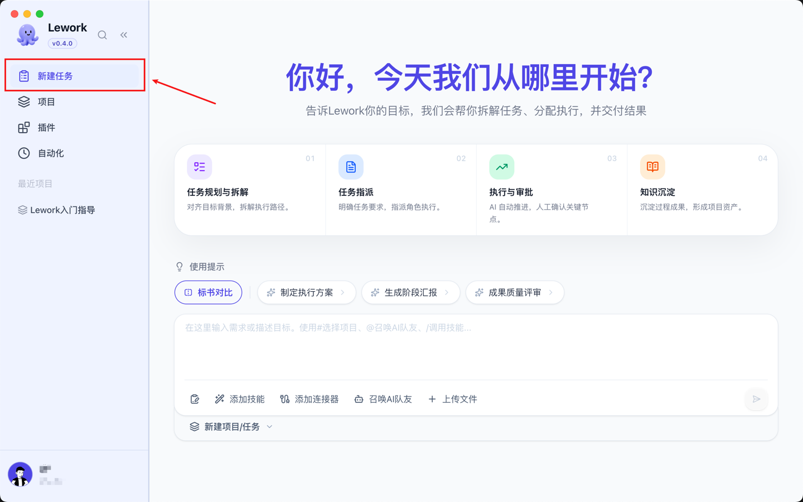
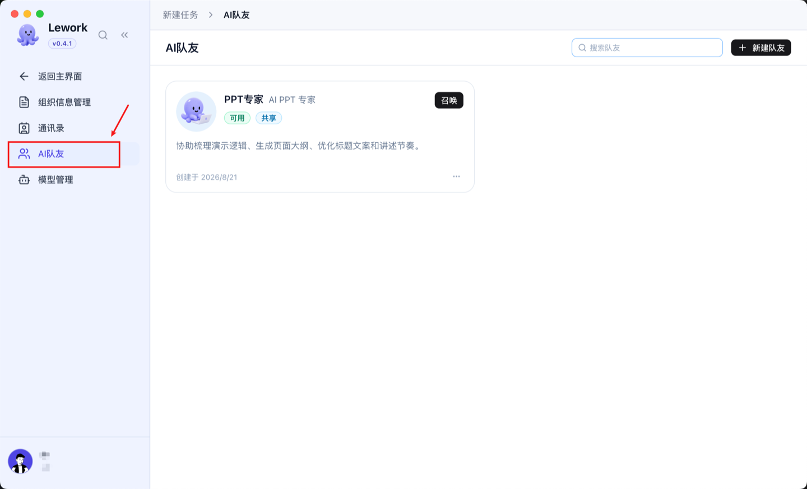
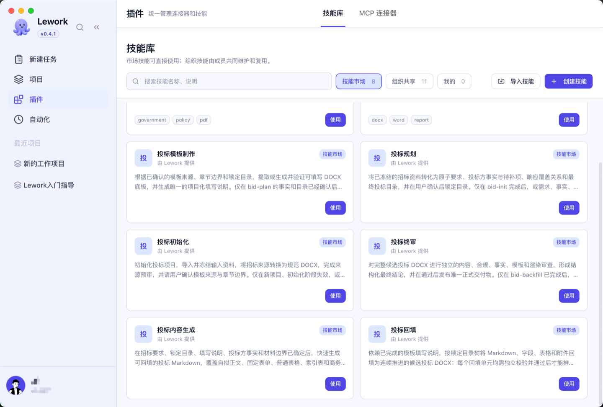
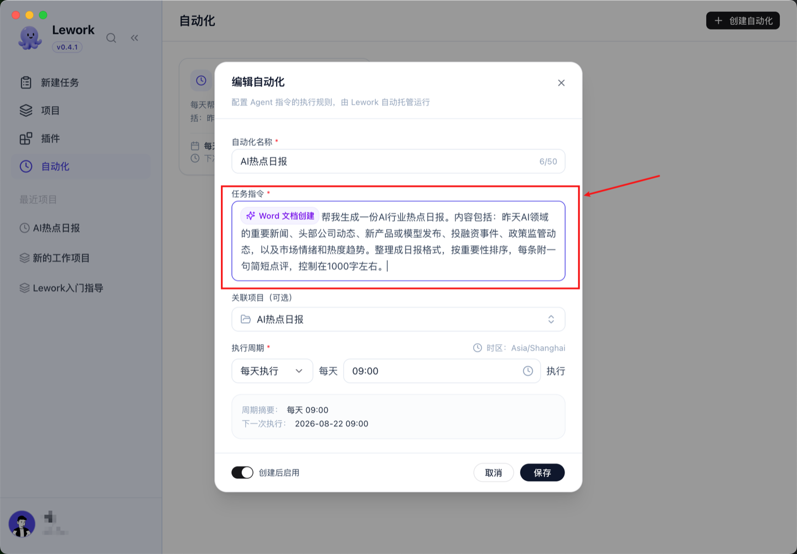
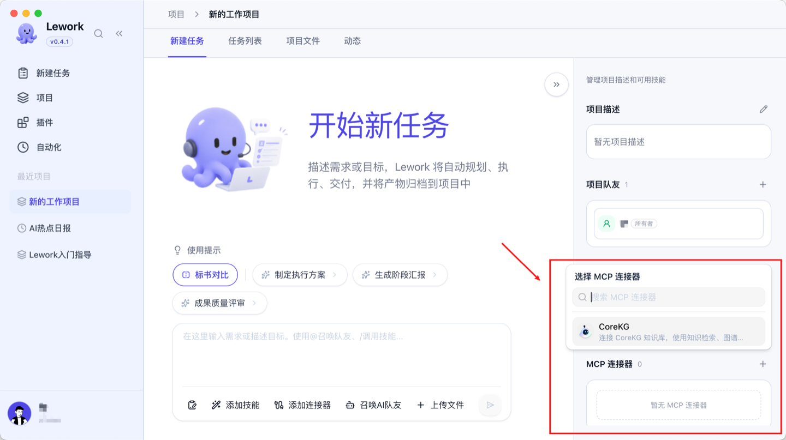

<div align="center">

<!--
  素材说明：
  - badge（license / go / web / protocol-mcp / website）：仓库内置自包含 SVG，见 docs/images/badges/，不依赖外网。
  - logo：docs/images/logo.png（原始素材见 docs/images/logo.svg）。
-->


# Lework

开源企业级 AI 工作平台 —— 让 AI 从聊天工具变成**可以长期协同工作、交付成果、沉淀经验**的团队成员。

> 给 AI 一个项目、一个角色、一个任务。它独立执行，你验收结果。

[](./LICENSE)


[](https://leros.ai/)

**目录** · [项目简介](#项目简介) · [界面预览](#界面预览) · [一分钟理解](#一分钟理解) · [协作流程](#协作流程) · [核心实体](#核心实体) · [核心特性](#核心特性) · [系统架构](#系统架构) · [快速开始](#快速开始) · [开发指南](#开发指南) · [MCP Server](#mcp-server) · [生态与联动](#生态与联动) · [相关文档](#相关文档) · [贡献指南](#贡献指南) · [社区与支持](#社区与支持) · [许可证](#许可证)

</div>

---

## 项目简介

Lework 是一个面向企业与团队的开源 AI 工作平台。它是 [智慧矩阵（insmtx）](https://insmtx.com/)企业 AI 产品矩阵中的**企业级数字员工 / AI 队友**（官网：[leros.ai](https://leros.ai/)），并与同矩阵的 **CoreKG**（企业知识引擎）协同：CoreKG 提供知识供给，Lework 负责任务执行与经验沉淀。

它不是又一款开放的聊天机器人，也不是一个单纯的工作流编排引擎。Lework 把 AI 当作**可管理的生产力**——AI 辅助工作越来越普及，但产出往往收不回来，对话结束即清零。Lework 解决的是**没有分工、没有指派、没有交付物、没有追踪**的问题：

- 👥 **建团队** — 定义角色、绑定技能，创建 AI 队友；
- 📋 **派任务** — 指定负责人、预期产出、验收标准；
- 📦 **拿结果** — AI 独立执行，交付可追溯的产物；
- 🧠 **沉淀资产** — 上下文和产出持续积累，越用越强；
- 📊 **可管理** — 进度、质量、调用成本，全程可见可控。

### 核心实体

| 实体 | 做什么 | 交付什么 |
|---|---|---|
| **项目** | 划定协作边界，承载目标与上下文 | 项目级资产全景 |
| **任务** | 指派 AI 队友，明确产出要求 | 可验收的交付物 |
| **AI 队友** | 具有明确角色、工作说明、技能与权限边界的 AI 执行者 | 独立完成任务的执行者 |
| **技能（Skill）** | 一套可复用的工作方法与执行流程 | 代码、评审、测试、报告等 |
| **MCP 连接器** | 提供外部系统 / 工具的访问能力（如 CoreKG 知识库） | 企业知识、外部工具接入 |
| **自动化** | 按指定周期，用固定任务指令与技能自动执行 | 定时产出的结果 |
| **知识库** | 沉淀上下文和规范 | 不再需要反复交代背景 |
| **项目资产 / 文件** | 查看所有历史交付物 | 随时回溯、可复用 |

### 技术形态

- 服务端为 **Go 单体仓库**（module `github.com/insmtx/Leros`，Go 1.25），既能以聚合单体一键部署，也可按需拆分；
- 前端为 `frontend/` 下的 **pnpm + turbo monorepo**，含 Web 主界面（Next.js / React / TypeScript）与桌面端应用；
- 任务与事件经 **NATS JetStream** 分发，Agent 执行由 `backend/agent` 承载，支持 native / claude / codex / opencode 等多种运行时；
- 内置 **MCP Server**（对外暴露 Leros 运行时能力），同时作为 **MCP 客户端**通过连接器接入外部系统与知识库（如 CoreKG）。

## 界面预览

**桌面工作台**（新建任务、任务规划与拆解、@ 调用 AI 队友）：

<p align="center"></p>

**AI 队友**（浏览、召唤与创建 AI 队友）：

<p align="center"></p>

**插件 · 技能库**（发现、导入和关联技能，管理 MCP 连接器）：

<p align="center"></p>

**自动化**（按周期用固定指令与技能自动执行）：

<p align="center"></p>

**连接 CoreKG 知识库**（通过 MCP 连接器在任务中检索企业知识、补充上下文并关联来源）：

<p align="center"></p>

## 一分钟理解

想象你有一个 AI 团队：

```
项目：新产品后台系统

  ├── AI 队友·架构师（角色：技术决策，技能：系统设计评审）
  ├── AI 队友·开发者 1（角色：后端开发，技能：Go 编程、API 设计）
  ├── AI 队友·开发者 2（角色：前端开发，技能：React、组件库）
  ├── AI 队友·QA（角色：质量保障，技能：测试用例生成、回归测试）
  └── AI 队友·PM（角色：进度管理，技能：日报生成、风险识别）

  ├── 任务：设计用户权限模型 → 指派给 架构师
  ├── 任务：实现登录接口 → 指派给 开发者 1
  ├── 任务：构建登录页面 → 指派给 开发者 2
  └── 任务：编写集成测试 → 指派给 QA
```

**每个 AI 队友有自己的角色、技能、权限边界和记忆。** 你创建任务、分配队友、跟踪进度 — 它们独立执行，产出代码、文档、报告。执行完成后，产物沉淀进知识库，下次类似任务不需要重新交代上下文。

## 协作流程

```
  💬 项目会话（讨论需求、对齐方案）
        ↓  方向明确
  📋 创建任务（定义目标、预期输出、指派 AI 队友）
        ↓
  ⚙️ AI 队友自主执行（调用技能、产出中间结果）
        ↓
  ✅ 人工审批 / 接管 / 补充上下文（关键节点）
        ↓
  📦 产出项目资产（文档 / 代码 / 报告 / 结构化数据）
        ↓
  🧠 沉淀知识库（下次不再重复交代）
```

每一步全程可审计、可回溯、可中断调整。**普通执行**适合目标明确的任务；**规划模式**适合复杂任务——先让 AI 梳理步骤、范围与执行方案，确认计划后再进入实际工作。平台通过 MCP、API、CLI、GUI 自动化等方式连接企业工具与业务系统，覆盖从需求理解、协同执行到成果交付的主要工作环节。

## 核心特性

### 任务驱动协作

| 能力 | 说明 |
|---|---|
| 项目管理 | 以项目为协同边界，承载目标、成员与上下文 |
| 任务系统 | 定义目标、预期产出与验收标准，指派 AI 队友 |
| AI 队友 | 角色分工、技能绑定、权限边界与独立记忆 |
| 多 Agent 调度 | 按任务目标自动拆解工作流，调度多个子 Agent 并行执行，各自独立上下文与执行状态 |
| 技能库 | 发现、安装、导入和管理技能（可复用的工作方法与执行流程），同类任务直接调用 |

### 企业级治理

| 能力 | 说明 |
|---|---|
| 多租户隔离 | 企业间数据与执行环境完全隔离 |
| RBAC 访问控制 | 用户、AI 队友、技能三级权限 |
| 执行审计 | 所有任务执行全链路可追溯、可回放 |
| 成本追踪 | 模型调用成本按任务、项目、团队维度统计 |
| 密钥安全 | API 密钥托管与脱敏 |
| 审批工作流 | 关键操作可配置人工审批节点 |
| 私有化部署 | 支持企业内部基础设施部署 |

### 能力接入

| 能力 | 说明 |
|---|---|
| 工具调用 | 连接知识库、MCP 连接器、浏览器与外部系统 |
| MCP 连接器 | 作为 MCP 客户端接入外部系统 / 工具（如 CoreKG 知识库），需关联到项目后使用 |
| MCP Server | 同时内置 MCP Server（StreamableHTTP），对外暴露 Leros 运行时能力，详见 [MCP Server](#mcp-server) |
| 自动化 | 按指定周期，用固定任务指令与技能让 AI 队友自动执行 |
| 规划模式 | 复杂任务先让 AI 梳理步骤、范围与执行方案，确认后再执行 |
| 多运行时 | native / claude / codex / opencode 等 Agent 运行时 |
| 共享记忆 | 记录项目背景、历史任务、团队偏好与执行上下文，协作越久越懂业务 |

**认证体系**

Lework 支持两种认证模式，通过编译时 build tag 选择：

| 模式 | 说明 | 构建命令 |
|---|---|---|
| **builtin**（默认） | 内置邮箱/手机/Worker Token 认证，开源版使用 | `go build -o ./bundles/leros ./backend/cmd/leros/` |
| **enterprise** | 委托至 IAM（身份认证管理）服务，企业版使用 | `go build -tags enterprise -o ./bundles/leros ./backend/cmd/leros/` |

企业版需在 `config.yaml` 中配置 IAM 服务地址：

```yaml
auth:
  mode: "enterprise"
  iam:
    base_url: "https://iam.example.com/v5"
```

开箱即用时无需配置 `auth` 块，默认使用内置认证。

## 系统架构

```
浏览器 / 桌面端 / Agent / MCP Client
        │  HTTP / WebSocket
        ▼
前端 Lework Web（Next.js）+ 桌面端（frontend/，pnpm + turbo monorepo）
        ▼
Go 服务层 —— leros（backend/cmd/leros 聚合入口，:8080）
   · server     HTTP API + 命令入口（chat / session / task / project / skill / login）
   · worker     异步任务 / Agent 执行 worker
   · agent      执行核心：runtime → adapter → executor → tool / interaction / node_event
        │
        ├─▶ 消息与事件（NATS JetStream）
        ├─▶ 存储层（PostgreSQL · 本地/对象存储）
        └─▶ MCP Server（backend/internal/worker/mcp，StreamableHTTP）
```

- 分层与包结构见 [docs/architecture/backend.md](docs/architecture/backend.md) 与 [docs/architecture/overview.md](docs/architecture/overview.md)；
- Agent 执行核心与运行时见 [docs/architecture/agent-runtime.md](docs/architecture/agent-runtime.md) 与 [docs/architecture/workspace-artifact.md](docs/architecture/workspace-artifact.md)；
- 设计哲学见 [docs/architecture/design-philosophy.md](docs/architecture/design-philosophy.md)。

## 快速开始

### 环境要求

- Git
- Docker 与 Docker Compose（推荐的一键部署路径）
- 仅使用宿主开发模式时：Go 1.25+、Node.js / pnpm（前端）

### 配置约定

所有含密钥 / 连接串的运行配置一律**不入库**，仓库仅提供 `*.example` 模板；使用时复制为真实文件并填写占位值：

```bash
git clone https://github.com/insmtx/Lework.git
cd Lework
git config pull.rebase true

# 复制配置模板（见仓库根目录 config.example.yaml）
cp config.example.yaml config.yaml
# 编辑 config.yaml，将 change-me / 占位值替换为真实值
```

### 方式一：Docker Compose 一键启动（推荐）

```bash
# 1) 补齐运行配置（见上方“配置约定”）
# 2) 构建并启动（构建 localhost/env_leros 镜像后拉起 PostgreSQL / NATS / leros / worker）
make docker-compose-up
# 镜像已构建时，可直接用 docker-compose 启动
make run-detached
docker compose -f deployments/env/docker-compose.yml up -d
```

启动完成后：

- 服务端 API 位于 **http://localhost:8080**（`leros` 容器，`server --config`）
- 消息总线 NATS JetStream 监控位于 **http://localhost:8222**
- 前端 Web 默认监听 **http://localhost:3005**

中间件的端口 / 凭据 / 初始化细节见 [docs/operations/private-deployment-guide.md](docs/operations/private-deployment-guide.md)。

### 方式二：宿主开发模式

```bash
make dev-setup      # 一次性初始化（建库、依赖、配置）
make dev-server     # 宿主机运行后端服务（server）
make dev-worker     # 宿主机运行异步 worker
make dev-frontend   # 前端开发容器
```

> 构建 / 运行命令与镜像目标见 [Makefile](Makefile)。命令与配置说明见 [docs/operations/private-deployment-config.md](docs/operations/private-deployment-config.md) 与 [docs/operations/project-structure.md](docs/operations/project-structure.md)。

## 开发指南

### 仓库结构

```
Lework/
├── backend/            # Go 后端（cmd/leros 为进程入口）
│   ├── cmd/leros/      #   cobra 命令：server / worker / chat / session / task / project / skill / login 等
│   ├── agent/          #   执行核心（runtime / adapter / executor / tool / interaction / node_event）
│   ├── internal/       #   业务逻辑（adapter、api、infra、service、worker、modelrouter、llm 等）
│   ├── tools/          #   Tool 注册表 + 具体工具（artifact_declare、memory、node、skill_manage、skill_use、todo）
│   ├── types/          #   领域类型 + DB 表常量
│   └── config/         #   配置
├── frontend/           # 前端（pnpm + turbo monorepo：@leros/web、@leros/desktop）
├── deployments/        # Docker / 私有化部署
├── docs/               # 文档（architecture / product / design / frontend / operations / swagger）
├── config.example.yaml / minimal-config.yaml
├── Makefile / go.mod / AGENTS.md / CHANGELOG.md / CONTRIBUTING.md / LICENSE
```

### 常用命令

```bash
# 构建后端（默认 builtin 认证）
make build                       # → bundles/leros
# 企业版构建（认证委托 IAM）
make build BUILD_TAGS=enterprise

# 本地运行（docker-compose）
make run / make run-detached / make stop / make logs

# 开发
make dev-setup / dev-server / dev-worker / dev-frontend

# API 文档
make swagger                     # 生成 docs/swagger

# 测试
go test ./...                    # 默认（排除 integration / enterprise）
go test ./backend/internal/<pkg>
```

### 约定与注意

- **模块路径**：所有内部 import 使用 `github.com/insmtx/Leros/...` 前缀；
- **分层严格**：`cmd/leros`（进程入口，仅生命周期）→ `agent/**`（业务无关执行核心）→ `internal/**`（业务逻辑）→ `types/` / `config/`（共享类型），跨层边界与硬性规则详见根目录 [AGENTS.md](AGENTS.md)；
- **测试非隔离**：多数包级测试依赖真实中间件（PostgreSQL / NATS），建议先 `make dev-up` 再运行相关包级测试；
- **生成文件勿手改**：`docs/swagger/`（swag 生成）等生成文件不要手动编辑。

## MCP Server

Lework 在 MCP 生态里是**双角色**：既作为 **MCP Server** 对外暴露自身能力，也作为 **MCP 客户端**（连接器）接入外部系统与知识库。

### 对外暴露能力（MCP Server）

`backend/internal/worker/mcp` 内置 **MCP (Model Context Protocol) Server**，用标准协议对外暴露 Leros 的运行时能力，AI 代理可直接把 Leros 当作可调用的"同事"来接入。

| 项目 | 说明 |
|---|---|
| 传输 | StreamableHTTP（MCP 服务端，`backend/internal/worker/mcp`） |
| 暴露能力 | 通过 `tools.Tool` 注册的 Leros 工具（如 `skill_manage` 等）映射为 MCP Tool |
| 鉴权 | 实例级 Token 鉴权（`NewServerWithToken`） |

工具清单与接入方式见仓库内实现：`backend/internal/worker/mcp` 与 `backend/tools/`。

### 接入外部系统（MCP 连接器）

在"插件 → MCP 连接器"中管理外部系统连接，提供外部系统 / 工具的**访问能力**（区别于描述可复用方法的**技能**）。连接器需关联到目标项目后，任务运行时才会使用。CoreKG 知识库即一种 MCP「平台连接器」，用于在任务中检索企业知识、补充上下文并关联来源。

## 生态与联动

Lework 是 [智慧矩阵（insmtx）](https://insmtx.com/)企业 AI 产品矩阵的一员，与同矩阵的其他产品协同，形成从能力供给到业务执行的闭环：

| 产品 | 角色 | 说明 |
|---|---|---|
| **[Lework](https://leros.ai/)** | 企业级 AI 工作平台 / 数字员工 | 以真实项目成员身份接收与执行任务、交付成果，沉淀 Skill 与项目记忆（本仓库） |
| **[CoreKG](https://corekg.com/)** | 企业 AI 知识引擎 | 多源知识接入、治理、理解与检索，提供知识问答、知识图谱、引用溯源；在 Lework 中以 MCP「平台连接器」供任务检索企业知识、补充上下文并关联来源 |
| [CatAPI](https://catapi.insmtx.com/) | AI 能力开放平台 | 通过标准 API 提供文档解析 / OCR / 结构化提取等成熟 AI 能力 |
| [Insmtx Cloud](https://insmtx.com/) | 大模型管理平台 | 模型接入、智能路由、权限与用量管理 |
| [Insmtx 20](https://insmtx.com/all-in-one) | AI 大模型一体机 | 本地 GPU、模型预装、内网运行的私有化算力底座 |

**数据流协同**：`企业数据 → CatAPI / CoreKG（知识供给）→ Lework（任务执行与成果沉淀）→ Skill / 项目记忆 / 企业知识持续回流`。

**与 CoreKG 的联动机制**：在 Lework 中，CoreKG 作为 MCP「平台连接器」接入（插件 → MCP 连接器）。先在插件页确认 CoreKG 状态为"已连接"，再将连接器关联到目标项目；新建任务时明确检索范围、关键词与输出格式，AI 便会基于企业知识作答并给出可溯源的出处。未关联到项目时，任务不会自动使用该知识库。

一言以蔽之：**CoreKG 让企业知识"看得见、找得到、答得准、用得上"，Lework 让这些知识与数字员工一起把任务真正做完**，两者共同构成智慧矩阵的企业智能化闭环。

## 相关文档

| 文档 | 内容 |
|---|---|
| [docs/architecture/overview.md](docs/architecture/overview.md) | AI OS 架构设计（三核架构） |
| [docs/architecture/backend.md](docs/architecture/backend.md) | 后端包结构设计 |
| [docs/architecture/agent-runtime.md](docs/architecture/agent-runtime.md) | Agent Runtime 架构 |
| [docs/architecture/workspace-artifact.md](docs/architecture/workspace-artifact.md) | Agent 工作空间与产物设计 |
| [docs/design/tech-design.md](docs/design/tech-design.md) | 技术设计（技能 Schema、渲染引擎） |
| [docs/product/prd.md](docs/product/prd.md) | 产品需求文档 |
| [docs/product/planning.md](docs/product/planning.md) | 路线图规划 |
| [docs/product/lework-product-whitepaper.md](docs/product/lework-product-whitepaper.md) | 产品功能白皮书 |
| [docs/operations/private-deployment-guide.md](docs/operations/private-deployment-guide.md) | 私有化部署指南 |
| [docs/operations/project-structure.md](docs/operations/project-structure.md) | 项目结构索引 |
| [frontend/README.md](frontend/README.md) | 前端开发指南 |
| [leros.ai](https://leros.ai/) | Lework 官网（产品能力 / 技术架构 / 私有化方案） |
| [insmtx.com/products](https://insmtx.com/products) | 智慧矩阵产品矩阵（CoreKG · Lework · CatAPI 等） |

## 贡献指南

我们欢迎各种形式的贡献——Issue、文档、代码、使用反馈。

- **提 Issue**：前往 [GitHub Issues](https://github.com/insmtx/Lework/issues) 报告缺陷或提出功能建议；
- **提 PR**：Fork 本仓库 → 创建功能分支 → 提交变更 → 发起 Pull Request。建议先开 Issue 讨论设计；
- **开发约定**：动手前请阅读根目录 [AGENTS.md](AGENTS.md)（仓库结构、工程与代码规范）与上方[开发指南](#开发指南)；
- **数据库迁移**：遵循仓库内迁移规范（见 [AGENTS.md](AGENTS.md) 与 `docs/`）。

## 社区与支持

- 使用问题 / 缺陷报告：[GitHub Issues](https://github.com/insmtx/Lework/issues)
- 功能需求与讨论：同上，请带 `feature` / `discussion` 标签发起
- 产品官网：[leros.ai](https://leros.ai/)
- **📰 近期动态**：最近运营宣传的公众号文章（[阅读全文](https://mp.weixin.qq.com/s/cqudtC3wBAQqLk509HsTWA)）

## 许可证

Lework 依据 **[Lework Open Source License](./LICENSE)** 授权：以 Apache License 2.0 为基础，附加若干商业使用条件（英文文本具有法律效力）。涉及多租户 SaaS、LOGO 与版权信息等特定情形时，需联系维护者取得商业许可，详见 LICENSE 文件。
